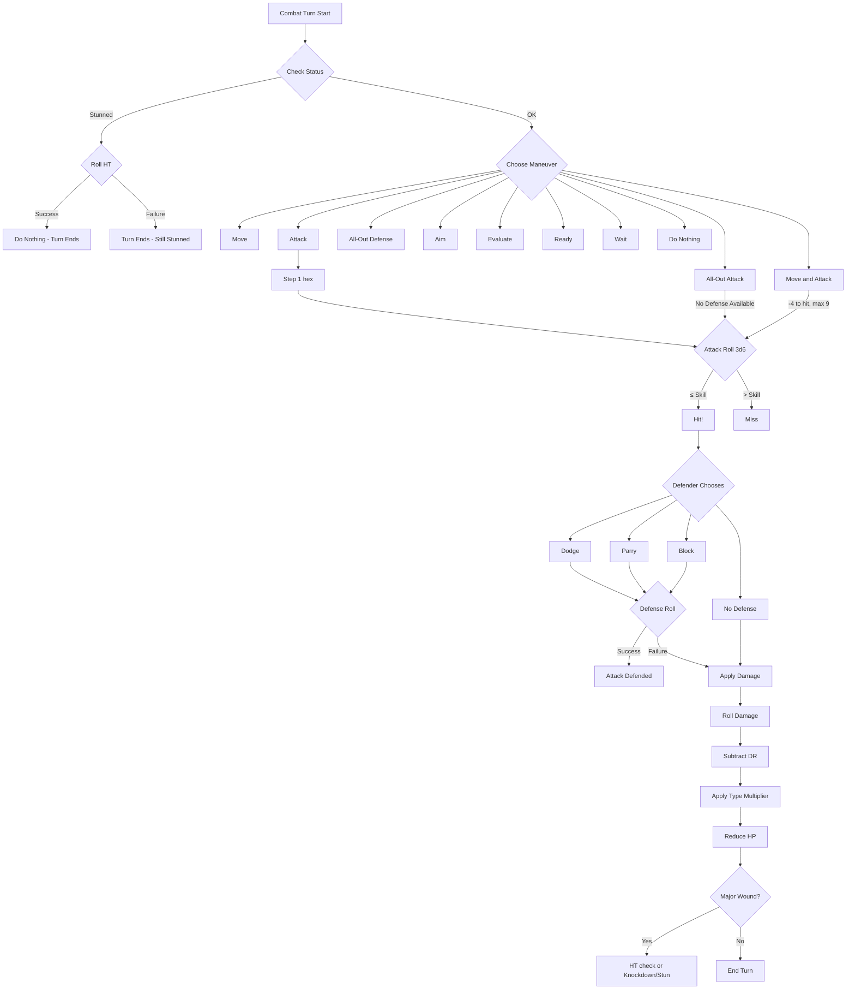

# GURPS Combat Turn Decision Tree

Reference: GURPS Basic Set 4th Edition (B362-B392)

## Overview

Each combat turn represents 1 second of game time. A player's turn follows this sequence:

```
┌─────────────────────────────────────────────────────────────────┐
│                    COMBAT TURN STRUCTURE                        │
├─────────────────────────────────────────────────────────────────┤
│  1. BEGIN TURN                                                  │
│     └─► Check status (stunned? unconscious? grappled?)          │
│                                                                 │
│  2. CHOOSE MANEUVER (mandatory - pick exactly one)              │
│     └─► See Maneuver Decision Tree below                        │
│                                                                 │
│  3. EXECUTE MANEUVER                                            │
│     └─► Movement, attacks, or other actions                     │
│                                                                 │
│  4. END TURN                                                    │
│     └─► Resolve effects, pass to next combatant                 │
└─────────────────────────────────────────────────────────────────┘
```

---

## Phase 1: Begin Turn

```
┌─────────────────────────────────────────────────────────────────┐
│                      BEGIN TURN CHECK                           │
├─────────────────────────────────────────────────────────────────┤
│                                                                 │
│  Are you UNCONSCIOUS (HP ≤ 0 and failed HT check)?              │
│    ├─► YES: Skip turn entirely                                  │
│    └─► NO: Continue                                             │
│                                                                 │
│  Are you STUNNED?                                               │
│    ├─► YES: Roll HT to recover                                  │
│    │        ├─► Success: Recover, but turn ends (Do Nothing)    │
│    │        └─► Failure: Remain stunned, turn ends              │
│    └─► NO: Continue                                             │
│                                                                 │
│  Are you GRAPPLED?                                              │
│    ├─► YES: Limited actions (see Grapple Options)               │
│    └─► NO: Full actions available                               │
│                                                                 │
│  Clear temporary effects from last turn:                        │
│    • Remove "shock" penalty                                     │
│    • Remove "defending" status                                  │
│    • Reset "has_stepped" flag                                   │
│                                                                 │
└─────────────────────────────────────────────────────────────────┘
```

---

## Phase 2: Maneuver Selection

### Complete Maneuver List

| Maneuver | Movement | Attack | Defense | Special |
|----------|----------|--------|---------|---------|
| **Do Nothing** | None | No | Normal | - |
| **Move** | Full Move | No | Normal | Can change facing |
| **Attack** | Step (1 hex) | Yes | Normal | Standard attack |
| **All-Out Attack** | Half Move | Yes (+bonus) | **NONE** | Choose: +4 hit, +2 dmg, or 2 attacks |
| **All-Out Defense** | Step (1 hex) | No | +2 bonus | Choose: +2 Dodge, +2 Parry, or +2 Block |
| **Move and Attack** | Full Move | Yes (-4, max 9) | Normal | Reduced accuracy |
| **Aim** | Step (1 hex) | No | Normal | +Acc bonus next attack |
| **Evaluate** | Step (1 hex) | No | Normal | +1 to hit next turn (max +3) |
| **Ready** | Step (1 hex) | No | Normal | Prepare weapon/item |
| **Concentrate** | Step (1 hex) | No | Normal | Mental actions, spells |
| **Wait** | Varies | Varies | Normal | Interrupt trigger |

### Maneuver Decision Tree

```
┌─────────────────────────────────────────────────────────────────┐
│                   WHAT DO YOU WANT TO DO?                       │
├─────────────────────────────────────────────────────────────────┤
│                                                                 │
│  ┌─► Want to ATTACK an enemy?                                   │
│  │                                                              │
│  │   ├─► Need to MOVE far first?                                │
│  │   │     └─► MOVE AND ATTACK                                  │
│  │   │         • Full Move + Attack                             │
│  │   │         • -4 to hit, max effective skill 9               │
│  │   │         • Cannot use ranged weapons                      │
│  │   │                                                          │
│  │   ├─► Want MAXIMUM damage/accuracy?                          │
│  │   │     └─► ALL-OUT ATTACK                                   │
│  │   │         • Choose ONE:                                    │
│  │   │           - Determined: +4 to hit                        │
│  │   │           - Strong: +2 to damage (or +1/die)             │
│  │   │           - Double: Two attacks (same or diff targets)   │
│  │   │           - Feint: Attack + Feint combo                  │
│  │   │         • WARNING: No active defense until next turn!    │
│  │   │         • Half Move allowed                              │
│  │   │                                                          │
│  │   └─► Standard attack with defenses?                         │
│  │         └─► ATTACK                                           │
│  │             • Step (1 hex) + Attack                          │
│  │             • Full defenses available                        │
│  │                                                              │
│  ├─► Want to MOVE without attacking?                            │
│  │     └─► MOVE                                                 │
│  │         • Move up to Basic Move in hexes                     │
│  │         • Can change facing freely                           │
│  │         • Can Sprint: +20% Move, -2 defense                  │
│  │                                                              │
│  ├─► Want to DEFEND optimally?                                  │
│  │     └─► ALL-OUT DEFENSE                                      │
│  │         • +2 to one defense type (Dodge, Parry, or Block)    │
│  │         • OR +1 to all defenses (Enhanced variant)           │
│  │         • Step (1 hex) allowed                               │
│  │         • No attacks                                         │
│  │                                                              │
│  ├─► Using a RANGED weapon?                                     │
│  │     └─► AIM (for accuracy)                                   │
│  │         • Turn 1: +Acc bonus                                 │
│  │         • Turn 2: +1 additional                              │
│  │         • Turn 3+: +1 more (max +2 extra = Acc+2)            │
│  │         • Bracing adds +1 more                               │
│  │         • Lost if you take damage or move > 1 step           │
│  │                                                              │
│  ├─► Want to STUDY opponent for bonus?                          │
│  │     └─► EVALUATE                                             │
│  │         • +1 to attack vs that foe next turn                 │
│  │         • Stacks up to +3 over multiple turns                │
│  │         • Lost if you attack different target                │
│  │                                                              │
│  ├─► Need to PREPARE something?                                 │
│  │     └─► READY                                                │
│  │         • Draw/sheathe weapon                                │
│  │         • Reload ranged weapon                               │
│  │         • Pick up item                                       │
│  │         • Open door                                          │
│  │                                                              │
│  ├─► Want to REACT to enemy action?                             │
│  │     └─► WAIT                                                 │
│  │         • Specify trigger condition                          │
│  │         • When triggered: take Attack or other action        │
│  │         • If not triggered: lose the action                  │
│  │                                                              │
│  └─► Taking NO action?                                          │
│        └─► DO NOTHING                                           │
│            • Useful when stunned/recovering                     │
│            • Still get active defenses                          │
│                                                                 │
└─────────────────────────────────────────────────────────────────┘
```

---

## Phase 3: Movement Sub-Tree

```
┌─────────────────────────────────────────────────────────────────┐
│                     MOVEMENT OPTIONS                            │
├─────────────────────────────────────────────────────────────────┤
│                                                                 │
│  MOVEMENT ALLOWANCE BY MANEUVER:                                │
│  ┌─────────────────────────────────────────────────────┐        │
│  │ Maneuver          │ Movement Allowed               │        │
│  ├────────────────────┼────────────────────────────────┤        │
│  │ Move              │ Full Basic Move                │        │
│  │ Move and Attack   │ Full Basic Move                │        │
│  │ All-Out Attack    │ Half Basic Move                │        │
│  │ Attack            │ Step (1 hex)                   │        │
│  │ Aim               │ Step (1 hex)                   │        │
│  │ Evaluate          │ Step (1 hex)                   │        │
│  │ All-Out Defense   │ Step (1 hex)                   │        │
│  │ Ready             │ Step (1 hex)                   │        │
│  │ Concentrate       │ Step (1 hex)                   │        │
│  │ Do Nothing        │ None                           │        │
│  └─────────────────────────────────────────────────────┘        │
│                                                                 │
│  FACING RULES:                                                  │
│  • First facing change per turn: FREE                           │
│  • Additional facing changes: 1 MP per hex-side rotated         │
│  • Can face any direction at end of movement                    │
│                                                                 │
│  BACKWARD MOVEMENT:                                             │
│  • Moving backward: 2 MP per hex (instead of 1)                 │
│  • Cannot run backward                                          │
│                                                                 │
│  POSTURE EFFECTS:                                               │
│  ┌─────────────────────────────────────────────────────┐        │
│  │ Posture    │ Move Mult │ Attack Mod │ Defense Mod  │        │
│  ├────────────┼───────────┼────────────┼──────────────┤        │
│  │ Standing   │ x1        │ 0          │ 0            │        │
│  │ Crouching  │ x2/3      │ 0          │ -2 melee     │        │
│  │ Kneeling   │ x1/3      │ -2 melee   │ -2 melee     │        │
│  │ Prone      │ x0 (1/sec)│ -4 melee   │ -3 melee     │        │
│  └─────────────────────────────────────────────────────┘        │
│                                                                 │
└─────────────────────────────────────────────────────────────────┘
```

---

## Phase 3: Attack Resolution

```
┌─────────────────────────────────────────────────────────────────┐
│                   ATTACK RESOLUTION SEQUENCE                    │
├─────────────────────────────────────────────────────────────────┤
│                                                                 │
│  STEP 1: Calculate Effective Skill                              │
│  ┌─────────────────────────────────────────────────────────┐    │
│  │ Base Skill (weapon skill level)                         │    │
│  │   + Aim bonus (if aiming)                               │    │
│  │   + Evaluate bonus (if evaluated, max +3)               │    │
│  │   + All-Out Attack bonus (+4 Determined)                │    │
│  │   - Range penalty (see range table)                     │    │
│  │   - Target size modifier                                │    │
│  │   - Posture penalty                                     │    │
│  │   - Shock penalty (from damage last turn)               │    │
│  │   - Move and Attack penalty (-4, max skill 9)           │    │
│  │   - Facing penalty (side -2, back -4)                   │    │
│  │   = EFFECTIVE SKILL                                     │    │
│  └─────────────────────────────────────────────────────────┘    │
│                                                                 │
│  STEP 2: Attack Roll                                            │
│  ┌─────────────────────────────────────────────────────────┐    │
│  │ Roll 3d6 vs Effective Skill                             │    │
│  │                                                         │    │
│  │ • Roll ≤ Skill: HIT (proceed to defense)                │    │
│  │ • Roll > Skill: MISS (attack ends)                      │    │
│  │                                                         │    │
│  │ CRITICAL SUCCESS (no defense allowed):                  │    │
│  │   • Roll of 3-4: Always critical                        │    │
│  │   • Roll of 5: Critical if skill ≥ 15                   │    │
│  │   • Roll of 6: Critical if skill ≥ 16                   │    │
│  │                                                         │    │
│  │ CRITICAL FAILURE:                                       │    │
│  │   • Roll of 18: Always critical failure                 │    │
│  │   • Roll of 17: Critical if skill ≤ 15                  │    │
│  │   • 10+ over skill: Critical failure                    │    │
│  └─────────────────────────────────────────────────────────┘    │
│                                                                 │
│  STEP 3: Active Defense (if hit, not critical)                  │
│  ┌─────────────────────────────────────────────────────────┐    │
│  │                                                         │    │
│  │ Defender chooses ONE defense:                           │    │
│  │                                                         │    │
│  │ DODGE = Basic Speed + 3                                 │    │
│  │   • Always available                                    │    │
│  │   • +3 if retreating (moving 1 hex away)                │    │
│  │   • +2 if All-Out Defense (Dodge)                       │    │
│  │   • -1 for each defense after the first this turn       │    │
│  │                                                         │    │
│  │ PARRY = (Weapon Skill / 2) + 3 + weapon modifier        │    │
│  │   • Requires ready melee weapon                         │    │
│  │   • +1 if retreating (Fencing weapons: +3)              │    │
│  │   • +2 if All-Out Defense (Parry)                       │    │
│  │   • -4 to parry flail weapons                           │    │
│  │   • Cannot parry bullets (usually)                      │    │
│  │                                                         │    │
│  │ BLOCK = (Shield Skill / 2) + 3 + shield modifier        │    │
│  │   • Requires ready shield                               │    │
│  │   • +1 if retreating                                    │    │
│  │   • +2 if All-Out Defense (Block)                       │    │
│  │   • Can block projectiles                               │    │
│  │                                                         │    │
│  │ Roll 3d6 vs Defense:                                    │    │
│  │   • Success: Attack is defended, no damage              │    │
│  │   • Failure: Proceed to damage                          │    │
│  │   • Critical Success (3-4): Perfect defense             │    │
│  │   • Critical Failure (17-18): Dropped weapon, fell, etc │    │
│  │                                                         │    │
│  │ NO DEFENSE IF:                                          │    │
│  │   • Defender used All-Out Attack                        │    │
│  │   • Defender is stunned                                 │    │
│  │   • Defender already defended this turn (cumulative -1) │    │
│  │   • Attack was a critical hit                           │    │
│  │   • Defender is unaware of attack                       │    │
│  │                                                         │    │
│  └─────────────────────────────────────────────────────────┘    │
│                                                                 │
│  STEP 4: Damage Resolution (if defense failed)                  │
│  ┌─────────────────────────────────────────────────────────┐    │
│  │                                                         │    │
│  │ 1. Roll Damage: Based on weapon                         │    │
│  │    • Melee: ST-based (e.g., "sw+2" or "thr+1")          │    │
│  │    • Ranged: Fixed (e.g., "2d+1")                       │    │
│  │                                                         │    │
│  │ 2. Subtract DR (Damage Resistance from armor)           │    │
│  │    • Penetrating damage = Rolled - DR                   │    │
│  │    • If 0 or less: No damage                            │    │
│  │                                                         │    │
│  │ 3. Apply Damage Type Multiplier:                        │    │
│  │    • Crushing (cr): x1                                  │    │
│  │    • Cutting (cut): x1.5                                │    │
│  │    • Impaling (imp): x2                                 │    │
│  │    • Piercing (pi): x1                                  │    │
│  │    (Round down after multiplying)                       │    │
│  │                                                         │    │
│  │ 4. Apply to HP                                          │    │
│  │    • Reduce current HP by final damage                  │    │
│  │    • Shock: -1 per HP lost (max -4) to DX/IQ next turn  │    │
│  │                                                         │    │
│  └─────────────────────────────────────────────────────────┘    │
│                                                                 │
└─────────────────────────────────────────────────────────────────┘
```

---

## Close Combat Decision Tree

```
┌─────────────────────────────────────────────────────────────────┐
│                    CLOSE COMBAT (Distance 0)                    │
├─────────────────────────────────────────────────────────────────┤
│                                                                 │
│  ENTERING CLOSE COMBAT:                                         │
│  • Move into enemy's hex (requires successful DX roll)          │
│  • Or enemy moves into your hex                                 │
│  • Or grapple attempt                                           │
│                                                                 │
│  IN CLOSE COMBAT, YOU CAN:                                      │
│  ┌─────────────────────────────────────────────────────────┐    │
│  │                                                         │    │
│  │ 1. ATTACK (with limitations)                            │    │
│  │    • Reach C weapons: Normal                            │    │
│  │    • Reach 1 weapons: -2 to hit and parry               │    │
│  │    • Reach 2+ weapons: CANNOT be used                   │    │
│  │                                                         │    │
│  │ 2. GRAPPLE                                              │    │
│  │    • Roll DX or Wrestling/Judo vs target's DX           │    │
│  │    • Success: Gain Control Points (CP)                  │    │
│  │    • CP = Margin of success (minimum 0)                 │    │
│  │                                                         │    │
│  │ 3. GRAPPLING TECHNIQUES (if you have CP):               │    │
│  │    ├─► THROW: Knock down, deal damage                   │    │
│  │    ├─► LOCK: Arm/leg lock, ongoing pain                 │    │
│  │    ├─► CHOKE: Target loses FP each second               │    │
│  │    └─► PIN: Immobilize target completely                │    │
│  │                                                         │    │
│  │ 4. BREAK FREE (if grappled)                             │    │
│  │    • Roll ST or Wrestling vs their ST - CP              │    │
│  │    • Success: Escape grapple                            │    │
│  │                                                         │    │
│  │ 5. EXIT CLOSE COMBAT                                    │    │
│  │    • Announce intention                                 │    │
│  │    • Opponent can: Let go, Follow, or Free Attack       │    │
│  │                                                         │    │
│  └─────────────────────────────────────────────────────────┘    │
│                                                                 │
│  DEFENSE MODIFIERS IN CLOSE COMBAT:                             │
│  • Dodge: Normal                                                │
│  • Parry: -2 with Reach 1 weapons, impossible with Reach 2+     │
│  • Block: -2 with medium/large shields                          │
│  • Retreat bonus: +1 (instead of +3)                            │
│                                                                 │
└─────────────────────────────────────────────────────────────────┘
```

---

## HP Thresholds & Status Checks

```
┌─────────────────────────────────────────────────────────────────┐
│                    HP THRESHOLDS                                │
├─────────────────────────────────────────────────────────────────┤
│                                                                 │
│  HP > 1/3 Max HP:                                               │
│    • Normal operation                                           │
│                                                                 │
│  HP ≤ 1/3 Max HP (Reeling):                                     │
│    • Move and Dodge halved                                      │
│                                                                 │
│  HP = 0:                                                        │
│    • Roll HT or fall unconscious                                │
│    • Make this roll every turn you're at 0 or below             │
│                                                                 │
│  HP = -1×HP (Dying):                                            │
│    • Roll HT or die                                             │
│    • Roll each time you lose another HP multiple                │
│                                                                 │
│  HP = -5×HP:                                                    │
│    • Automatic death                                            │
│                                                                 │
│  ┌─────────────────────────────────────────────────────────┐    │
│  │ Example (HP 10 character):                              │    │
│  │  • HP 4-10: Normal                                      │    │
│  │  • HP 1-3: Reeling (half Move/Dodge)                    │    │
│  │  • HP 0: HT check to stay conscious                     │    │
│  │  • HP -10: HT check to survive                          │    │
│  │  • HP -50: Dead                                         │    │
│  └─────────────────────────────────────────────────────────┘    │
│                                                                 │
└─────────────────────────────────────────────────────────────────┘
```

---

## Free Actions (No Maneuver Required)

```
┌─────────────────────────────────────────────────────────────────┐
│                      FREE ACTIONS                               │
├─────────────────────────────────────────────────────────────────┤
│                                                                 │
│  Can be done at any time during your turn:                      │
│                                                                 │
│  • Talk (a few sentences)                                       │
│  • Drop an item                                                 │
│  • Crouch (from standing)                                       │
│  • Look around                                                  │
│  • Maintain a spell (if already active)                         │
│                                                                 │
│  Cannot be done as free actions:                                │
│                                                                 │
│  • Draw weapon (requires Ready)                                 │
│  • Pick up item (requires Ready)                                │
│  • Stand up from prone (requires Change Posture maneuver)       │
│  • Attack (requires Attack or similar maneuver)                 │
│                                                                 │
└─────────────────────────────────────────────────────────────────┘
```

---

## Quick Reference: Range Penalties

```
┌────────────────────────────────────────┐
│ Distance (yards) │ Penalty            │
├──────────────────┼────────────────────┤
│ 0-2              │ 0                  │
│ 3                │ -1                 │
│ 4-5              │ -2                 │
│ 6-7              │ -3                 │
│ 8-10             │ -4                 │
│ 11-15            │ -5                 │
│ 16-20            │ -6                 │
│ 21-30            │ -7                 │
│ 31-50            │ -8                 │
│ 51-70            │ -9                 │
│ 71-100           │ -10                │
│ 100+             │ -11 (continues)    │
└────────────────────────────────────────┘
```

---

## Implemented vs. Planned Features

| Feature | Status | Notes |
|---------|--------|-------|
| Maneuvers: Move | ✅ Implemented | Full hex movement with facing |
| Maneuvers: Attack | ✅ Implemented | With step |
| Maneuvers: All-Out Attack | ✅ Implemented | +4 variant only |
| Maneuvers: All-Out Defense | ✅ Implemented | +2 dodge |
| Maneuvers: Move and Attack | ✅ Implemented | -4, max skill 9 |
| Maneuvers: Aim | ✅ Implemented | +Acc tracking |
| Maneuvers: Do Nothing | ✅ Implemented | |
| Maneuvers: Evaluate | ⏳ Planned | Not yet implemented |
| Maneuvers: Ready | ⏳ Planned | Not yet implemented |
| Maneuvers: Wait | ⏳ Planned | Requires interrupt system |
| Maneuvers: Concentrate | ⏳ Planned | For magic system |
| Active Defense: Dodge | ✅ Implemented | |
| Active Defense: Parry | ✅ Implemented | |
| Active Defense: Block | ✅ Implemented | |
| Retreat bonus | ⏳ Planned | |
| Close Combat | ✅ Implemented | Full system |
| Grappling | ✅ Implemented | With techniques |
| Damage Types | ✅ Implemented | cr, cut, imp, pi |
| Posture Effects | ✅ Implemented | All postures |
| Shock Penalty | ⏳ Planned | |
| Critical Hits/Misses | ✅ Implemented | Tables not yet |
| Hit Location | ⏳ Planned | Default torso |

---

## ASCII Combat Flow Diagram

```
                              ┌──────────────┐
                              │  YOUR TURN   │
                              └──────┬───────┘
                                     │
                    ┌────────────────┴────────────────┐
                    ▼                                 │
              ┌───────────┐                           │
              │ STUNNED?  │                           │
              └─────┬─────┘                           │
                    │                                 │
          ┌────YES──┴───NO────┐                       │
          ▼                   ▼                       │
    ┌─────────────┐    ┌──────────────┐               │
    │ Roll HT to  │    │   CHOOSE     │               │
    │  recover    │    │  MANEUVER    │               │
    └──────┬──────┘    └──────┬───────┘               │
           │                  │                       │
    Pass: Do Nothing          │                       │
    Fail: Turn ends           │                       │
                              ▼                       │
                    ┌──────────────────┐              │
                    │ EXECUTE MANEUVER │              │
                    └────────┬─────────┘              │
                             │                        │
         ┌───────────────────┼───────────────────┐    │
         ▼                   ▼                   ▼    │
    ┌─────────┐        ┌─────────┐         ┌─────────┐
    │  MOVE   │        │ ATTACK  │         │ OTHER   │
    └────┬────┘        └────┬────┘         └────┬────┘
         │                  │                   │
         │                  ▼                   │
         │          ┌───────────────┐           │
         │          │  Roll 3d6    │           │
         │          │  vs Skill    │           │
         │          └───────┬───────┘           │
         │                  │                   │
         │         HIT──────┴──────MISS         │
         │          │              │            │
         │          ▼              │            │
         │   ┌──────────────┐      │            │
         │   │   DEFENDER   │      │            │
         │   │   ROLLS      │      │            │
         │   │   DEFENSE    │      │            │
         │   └───────┬──────┘      │            │
         │           │             │            │
         │   SUCCESS─┴─FAILURE     │            │
         │      │         │        │            │
         │      │         ▼        │            │
         │      │   ┌──────────┐   │            │
         │      │   │  DAMAGE  │   │            │
         │      │   │  APPLIED │   │            │
         │      │   └──────────┘   │            │
         │      │         │        │            │
         └──────┴─────────┴────────┴────────────┘
                          │
                          ▼
                   ┌─────────────┐
                   │  END TURN   │
                   └─────────────┘
```

---

## Encumbrance & Movement

| Encumbrance Level | Weight Limit | Move Multiplier | Dodge Penalty |
|-------------------|--------------|-----------------|---------------|
| None (0) | ≤ Basic Lift | 1.0× | 0 |
| Light (1) | ≤ 2× BL | 0.8× | -1 |
| Medium (2) | ≤ 3× BL | 0.6× | -2 |
| Heavy (3) | ≤ 6× BL | 0.4× | -3 |
| Extra-Heavy (4) | ≤ 10× BL | 0.2× | -4 |

Basic Lift (BL) = ST² / 5 (in lbs)

---

## All-Out Attack Variants (B365)

| Variant | Bonus | Restriction |
|---------|-------|-------------|
| **Determined** | +4 to hit | Single attack |
| **Strong** | +2 damage OR +1 per die | Single melee attack |
| **Double** | Two attacks | Same or different targets |
| **Feint** | Feint then Attack | Melee only |

**WARNING**: No active defenses until your next turn!

---

## All-Out Defense Variants (B366)

| Variant | Bonus |
|---------|-------|
| **Increased Defense** | +2 to ONE defense type (all uses this turn) |
| **Double Defense** | Use two DIFFERENT defenses vs same attack |

---

## Hit Location Table (B398-400)

| Location | To-Hit Penalty | Damage Multiplier | Notes |
|----------|----------------|-------------------|-------|
| Torso | 0 | ×1 | Default target |
| Vitals | -3 | ×3 (imp/pi) | Heart, lungs, kidneys |
| Skull | -7 | ×4 | +2 DR from bone |
| Face | -5 | ×1 | No DR from skull |
| Eye | -9 | ×4 | Only imp/pi; no DR |
| Neck | -5 | ×2 (cut) | Choking attacks |
| Arm | -2 | ×1 | Cripple at HP/2 |
| Leg | -2 | ×1 | Cripple at HP/2 |
| Hand | -4 | ×1 | Cripple at HP/3 |
| Foot | -4 | ×1 | Cripple at HP/3 |
| Groin | -3 | ×1 | Knockdown on any damage |

---

## Mermaid Diagram (for rendering)



---

## References

- GURPS Basic Set 4th Edition, Chapters 11-12 (B362-B392)
- GURPS Martial Arts (for advanced grappling)
- [GURPS Wiki](https://gurps.fandom.com)
- [Dungeon Fantastic Blog](https://dungeonfantastic.blogspot.com)

---

*Document generated for GURPS Combat Simulator project*
*Based on GURPS Basic Set 4th Edition, B362-B392*
